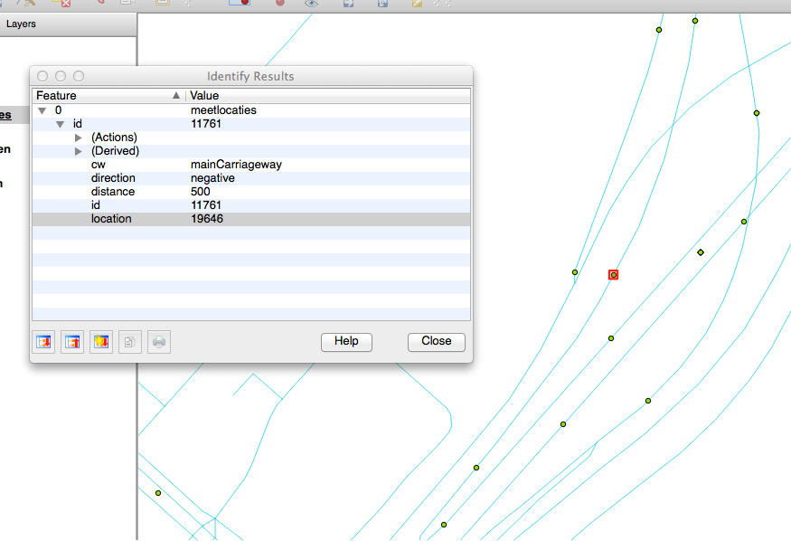
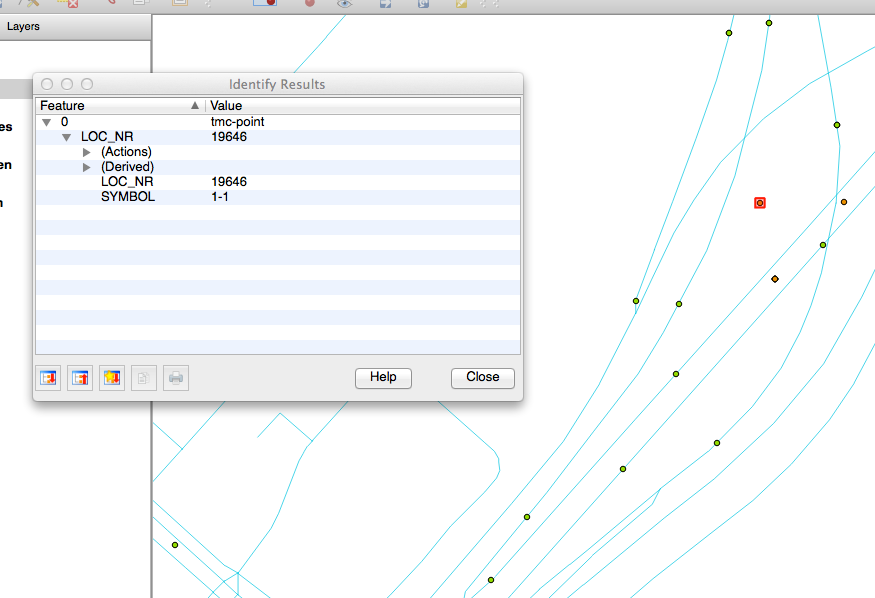

# Meetlocatie

Onderzoek, meetpunt 11761 op kruising A4 en A5 bij Hoofddorp
http://goo.gl/maps/4Da2M

Meetlocatie: `11761`

VILD-locatie: `19646`

Data uit VILD-database: 

    {
      "LOC_NR":       19646,
      "LOC_TYPE":     "P1.2",
      "LOC_DES":      "Knooppunt (triangle)",
      "ROADNUMBER":   "A5",
      "ROADNAME":     null,
      "FIRST_NAME":   "De Hoek",
      "SECND_NAME":   "A4",
      "JUNCT_REF":    19646,
      "EXIT_NR":      null,
      "HSTART_POS":   10,
      "HEND_POS":     10,
      "HSTART_NEG":   14,
      "HEND_NEG":     5,
      "HECTO_CHAR":   null,
      "HECTO_DIR":    1,
      "POS_IN":       0,
      "POS_OUT":      1,
      "NEG_IN":       1,
      "NEG_OUT":      1,
      "DIR":          null,
      "AREA_REF":     2433,
      "LIN_REF":      6338,
      "INTER_REF":    9240,
      "POS_OFF":      19648,
      "NEG_OFF":      0,
      "URBAN_CODE":   0,
      "PRES_POS":     1,
      "PRES_NEG":     1,
      "FAR_AWAY":     0,
      "CITY_DISTR":   null,
      "TOP_SIGN":     null,
      "TYPE_CODE":    0,
      "MW_REF":       443,
      "RW_NR":        5,
      "AW_REF":       420
    }

Verklaring van de velden:

    {
      "LOC_NR":       ,
      "LOC_TYPE":     ,
      "LOC_DES":      ,
      "ROADNUMBER":   ,
      "ROADNAME":     ,
      "FIRST_NAME":   ,
      "SECND_NAME":   ,
      "JUNCT_REF":    ,
      "EXIT_NR":      ,
      "HSTART_POS":   ,
      "HEND_POS":     ,
      "HSTART_NEG":   ,
      "HEND_NEG":     ,
      "HECTO_CHAR":   ,
      "HECTO_DIR":    ,
      "POS_IN":       ,
      "POS_OUT":      ,
      "NEG_IN":       ,
      "NEG_OUT":      ,
      "DIR":          ,
      "AREA_REF":     ,
      "LIN_REF":      "ID van lijn in tmc-line",
      "INTER_REF":    ,
      "POS_OFF":      ,
      "NEG_OFF":      ,
      "URBAN_CODE":   ,
      "PRES_POS":     ,
      "PRES_NEG":     ,
      "FAR_AWAY":     ,
      "CITY_DISTR":   ,
      "TOP_SIGN":     ,
      "TYPE_CODE":    ,
      "MW_REF":       ,
      "RW_NR":        ,
      "AW_REF":       
    }
